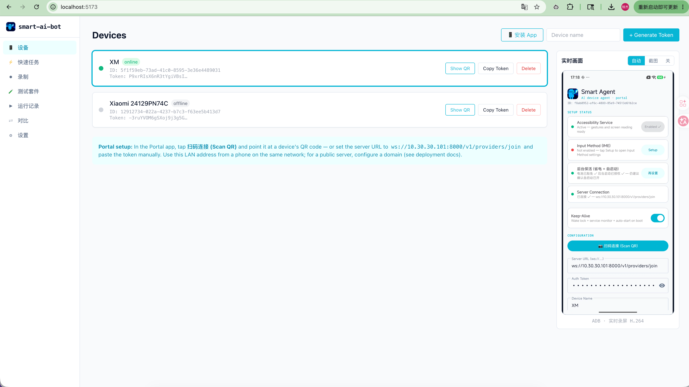
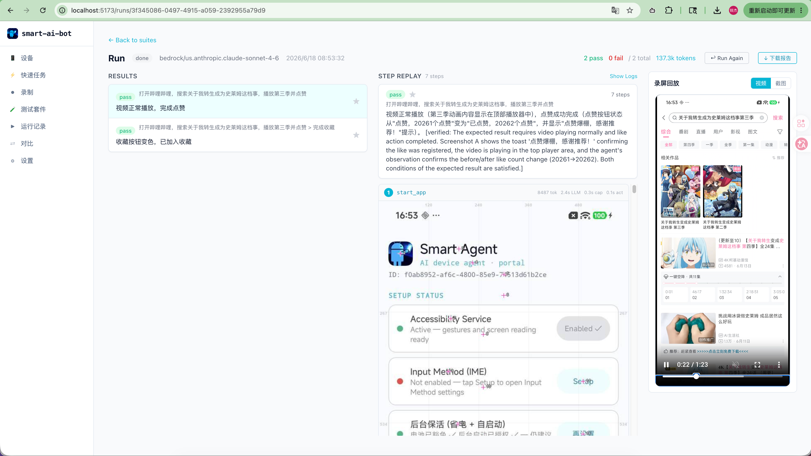
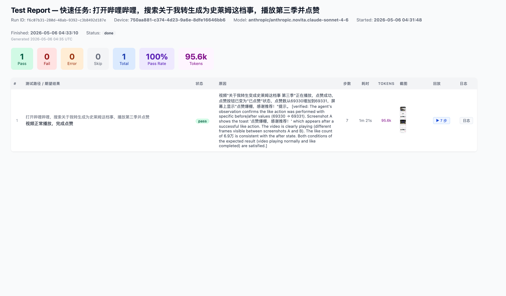
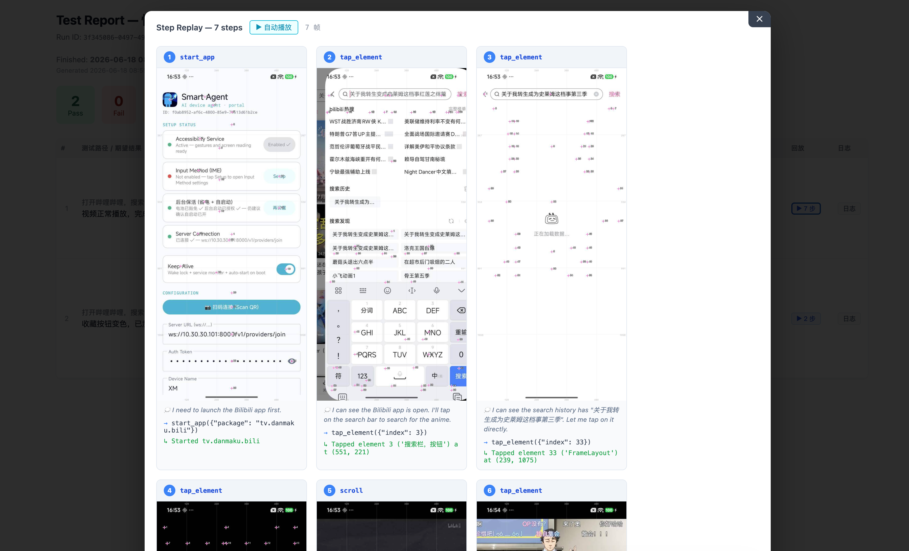

# Getting Started — from zero to your first test

> A complete walkthrough: start the server, connect a phone, write a
> plain-language test case, run it, and read the report.

**English** · [简体中文](getting-started.zh-CN.md)

By the end you'll have an AI agent running a test you wrote in plain English on
a real Android device, with a screenshot + reasoning trace for every step.

---

## 1. Prerequisites

- An **Android device** (real phone or emulator).
- An **LLM API key** for at least one provider (OpenAI / Anthropic / Gemini /
  Zhipu GLM / Groq, or a local Ollama).
- To run the server: **Docker** (easiest) *or* Python 3.9+ & Node.js 18+.

---

## 2. Start the server

**Docker (recommended):**

```bash
git clone https://github.com/rejigtian/Smart-AI-Bot.git
cd Smart-AI-Bot
docker compose up -d
```

**From source:**

```bash
git clone https://github.com/rejigtian/Smart-AI-Bot.git
cd Smart-AI-Bot
./start.sh        # starts backend (:8000) + frontend (:5173)
```

Then open the web UI:

- On the **same machine**: <http://localhost:5173>
- From a **phone on the same WiFi**: open the UI by the machine's **LAN IP**,
  e.g. `http://192.168.1.10:5173` — a real phone can't reach `localhost`.

> Public server / HTTPS / WSS setup → [Deployment](deployment.md).

---

## 3. Add your LLM API key

Open **Settings** in the web UI and paste a key for any provider you have.
This is what the agent uses to think. You can switch model per run later.

---

## 4. Connect your phone

Everything below also lives as a **collapsible guide on the Devices page** — you
don't have to memorize it.

**4a. Install the Portal app.** On the **Devices** page, click **📱 Install App**,
then scan the QR with the phone's browser to download and install
`SmartAgent-<version>.apk`. Allow *"install from unknown sources"* when asked.

**4b. Enable accessibility.** On the phone: **System Settings → Accessibility →
enable `AgentAccessibilityService`**. A persistent notification appears — that
means the Portal is running.

**4c. Pair the device.** Back in the web UI, click **+ Generate Token** to create
a device, then click **Show QR** on it. In the Portal app tap **Scan QR** and
scan it — the server URL + token fill in and it connects in one tap.

When the dot turns green and status reads **online**, you'll see the phone screen
mirrored live on the right:



> Can't connect? The Devices page has a **"Can't connect / QR unreachable?"**
> troubleshooter, and there's a full [Troubleshooting](troubleshooting.md) doc.
> The usual culprit is a VPN/virtual adapter making auto-detection pick an IP
> the phone can't reach — open the UI by the real LAN IP.

---

## 5. Write your first test case

Go to **Test Suites**, create a suite, and add a case. A case is just plain
language — what to do and what you expect:

```
Path: Open Settings, navigate to About Phone, capture the version number
Expected: System version info is shown, no error dialog
```

No XPath, no element IDs, no recorded script. You can also **import** cases from
YAML / Excel / xmind / Markdown.

---

## 6. Run it

Pick a **device** and a **model**, then hit **Run**. Watch the agent work in real
time — its thoughts, each tool call (`tap_element`, `screenshot`, …), and the
live device screen, all side by side:



---

## 7. Read the report

When the run finishes you get pass/fail, pass rate, token usage, run time, and a
per-case verdict with the verifier's reasoning:



Every step is replayable — the screenshot, the agent's reasoning, and the exact
tool call it made:



Export a **self-contained HTML report** (single file, screenshots embedded) to
share with your team. Failed cases auto-extract a *"lesson learned"* that's
re-injected next time so the agent avoids the same mistake.

---

## 8. Run from CI (optional)

```bash
cd backend
python cli.py run --suite <id> --device <id> --json
```

Exit code `0` = all passed, `1` = at least one failed. Wire it into CI and send
results to Feishu / DingTalk / Slack via webhooks.

---

## Where to go next

| Want to… | See |
|----------|-----|
| Deploy on a public server (HTTPS/WSS) | [Deployment](deployment.md) |
| Understand how the agent decides | [Agent Architecture](agent-architecture.md) |
| Feed the agent app-specific knowledge | [Test KB](../test_knowledge/README.md) |
| Fix a connection / recognition issue | [Troubleshooting](troubleshooting.md) |
